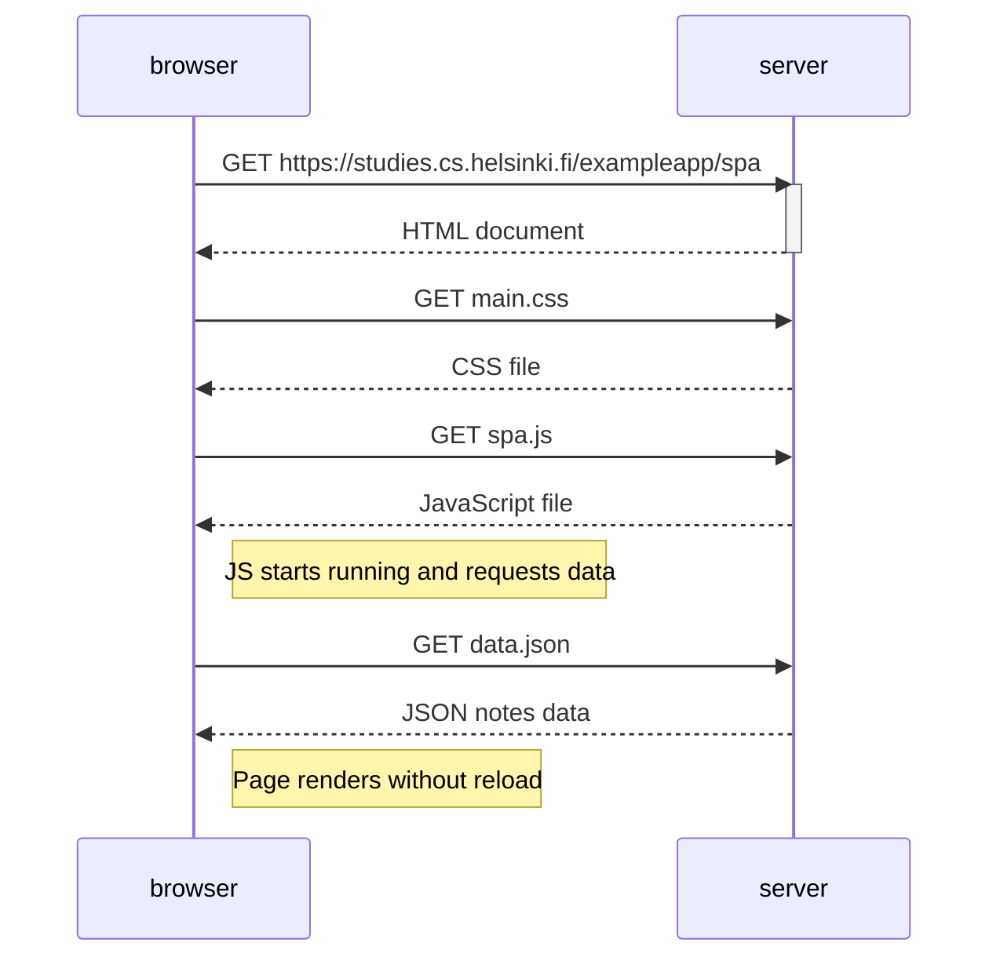

```mermaid
sequenceDiagram
    participant browser
    participant server

    browser->>server: GET https://studies.cs.helsinki.fi/exampleapp/spa
    activate server
    server-->>browser: HTML document
    deactivate server

    browser->>server: GET main.css
    server-->>browser: CSS file

    browser->>server: GET spa.js
    server-->>browser: JavaScript file

    Note right of browser: JS starts running and requests data

    browser->>server: GET data.json
    server-->>browser: JSON notes data

    Note right of browser: Page renders without reload
```
